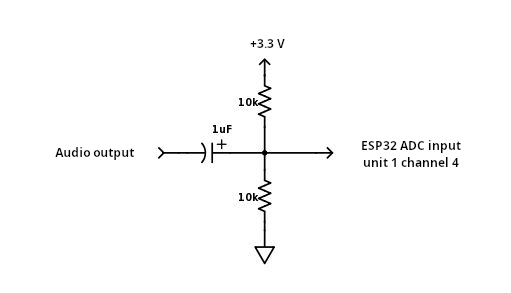

# IoT Algorithms and Services - Assignment
Individual assignment for IoT Algorithms and Services course

## Contents

- [Description](#description)
- [Circuit](#circuit)
- [Configuration](#configuration)
- [Build](#build)
- [Technical details](#technical-details)
- [Evaluation](#evaluation)

## Description

The goal of the assignment is to create an IoT system that collects information from a sensor, analyses the data locally and communicates to a nearby server an aggregated value of the sensor readings. The IoT system adapts the sampling frequency in order to save energy and reduce communication overhead. The IoT device will be based on an ESP32 prototype board and the firmware will be developed using the FreeRTOS.

[Full details](./docs/request.md)

## Circuit

This circuit is used to transform an audio signal, which is an analog signal centered around 0V, to a signal suitable for ADC input.

The voltage divider adds a DC offset of around 1.65V to the signal, while the capacitor is a RC high-pass filter which blocks the DC component from returning to the sound card.

In this way the signal is in the range 0V - 2.5V, which the ADC is capable to read.

For the standard ESP32 the pin corresponding to ADC1 channel 4 is GPIO32, while for the ESP32-S3 is GPIOxx.



## Configuration

Copy `main/config.sample.h` to `main/config.h` and edit it according to your preferences.

```c
#define NET_WIFI_SSID       "<wifi ssid>"
#define NET_WIFI_PASSWORD   "<wifi password>"

#define MQTT_BROKER_URL  "mqtts://<hostname>:8883"
#define MQTT_BASE_TOPIC  "/tests/esp32"
```

Also copy the MQTT broker certificate to `res/mqtt_cert.pem`.

## Build

To setup the ESP-IDF environment in the current shell and build for ESP32-S3:

```shell
source /opt/esp-idf/export.sh
idf.py set-target esp32s3
idf.py build
```

To flash image to the board:

```shell
idf.py flash
```

To open a serial monitor:

```shell
idf.py monitor
```

## Technical details

### ADC

ADC is put in continuous mode, so the signal is periodically sampled and put in an internal buffer directly by the library, using timers to have an accurate sampling period.

The samples are periodically collected by [`a_adc_collect_samples()`](./main/adc.c#L124) using a "buffer flush frequency", which is slightly higher (x1.2) than the sampling frequency to prevent buffer overflows.

In that function, between each call of `adc_continuous_read()`, the task is put to sleep using `vTaskDelay()` for an amount of time defined by that frequency.

Once the array is filled with the required number of samples, the function returns exactly after `num_samples / sampling_freq` seconds.

### Sample rate adaptation

To estimate optimal sampling frequency the program collects a fixed number of samples (ex. 8192) with an hardcoded initial frequency and computes an FFT.

Finds the maximum frequency of the input signal by scanning the output of the FFT and finding the maximum index (frequency) that has a value (magnitude) over a certain threshold.

This threshold accounts for signal noise, so is measured by providing the ESP an empty signal and finding the maximum magnitude that appears in the FFT.

To calculate the optimal sampling frequency, the maximum index of the array is divided by the array length to obtain an "adaptation factor" and multiplied by the original sampling frequency.

This frequency is then checked and restricted against ADC upper and lower bounds.

## Performance evaluation

[Link to evaluation document](./docs/evaluation.md)
