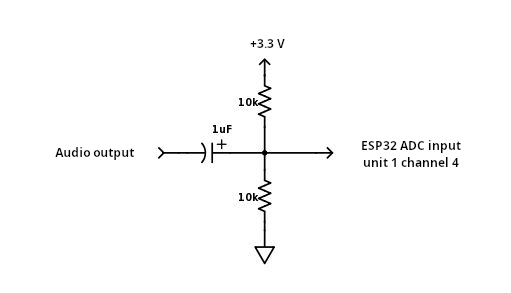

# IoT Algorithms and Services - Assignment
Individual assignment for IoT Algorithms and Services course


## Contents

- [Description](#description)
- [Request](#request)
- [Circuit](#circuit)
- [Configuration](#configuration)
- [Build](#build)
- [Evaluation](#evaluation)

## Description

High-level description

## Request

[Link](./res/request.md)

## Circuit



## Configuration

Copy `main/config.sample.h` to `main/config.h` and edit it according to your preferences.

```c
#define NET_WIFI_SSID       "<wifi ssid>"
#define NET_WIFI_PASSWORD   "<wifi password>"

#define MQTT_BROKER_URL  "mqtts://<hostname>:8883"
```

Also copy the MQTT broker certificate to `res/mqtt_cert.pem`.

## Build

To setup the ESP-IDF environment in the current shell and build for ESP32-S3:

```shell
source /opt/esp-idf/export.sh
idf.py set-target esp32s3
idf.py build
```

To flash image to the board:

```shell
idf.py flash
```

To open a serial monitor:

```shell
idf.py monitor
```

## Evaluation

[Link](./res/evaluation.md)
