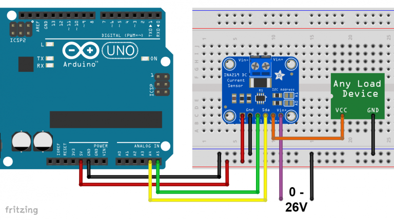
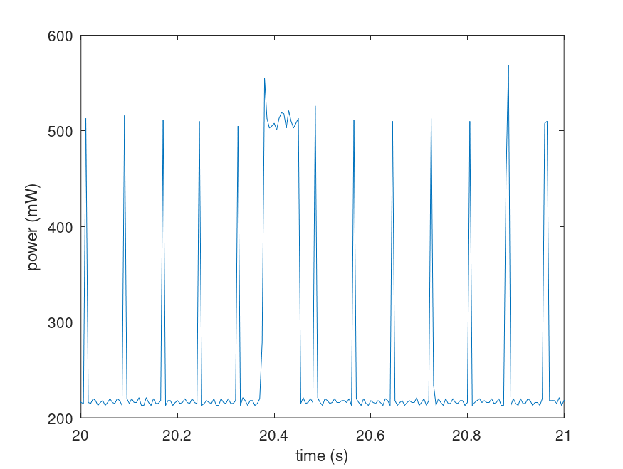
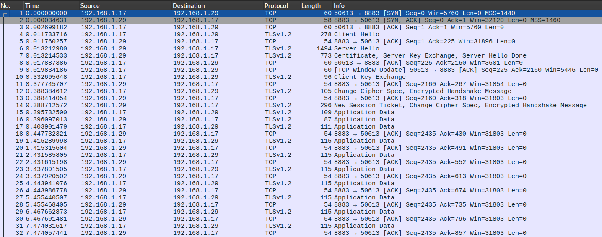

# Performance evaluation

## Contents

- [Energy consumption](#energy-consumption)
- [Network traffic](#network-traffic)
- [End to end latency](#end-to-end-latency)

### Energy consumption

#### Circuit

For the energy consumption evaluation the following circuit is used.



The code used by the Arduino is at [tools/measurement/measurement.ino](../tools/measurement/measurement.ino)

#### Graph



This graph represents the energy consumption after the system has already done sampling frequency adaptation and is running.

In this situation the active tasks are the sampling task (main program) and the communication task (WiFi library).
The sampling task copies periodically the ADC buffers and sleeps for the rest of the time, while the communication task activates when an MQTT packet has to be sent, so exactly every 1 second as defined.

It is possible to identify the peak related to an MQTT message transmission, which in the figure above is around 20.4 s. For about 100 ms the device consumption is 510 mW, 294 mW above base consumption.

Other peaks that occur about 10 times a second may also be related to WiFi, as the consumption is similar to transmission, but also the sampling task which runs an iteration about every 10 ms.

#### Comparison between input signals

Three different input signals are considered, to see if the sample rate is adapted optimally and measure the difference in power consumption.

The power consumption is measured after the WiFi and MQTT connection.

1. Combination of a sinusoid at 350 Hz and a sinusoid at 420 Hz, both with amplitude 1

	- Identified optimal sampling frequency at 866.00 Hz
	- Signal maximum allowed frequency: 433.00 Hz
	- Average power consumption: 249.50 mW

2. Combination of a sinusoid at 440 Hz, amplitude 1 and a sinusoid at 580 Hz amplitude 0.8

	- Identified optimal sampling frequency: 1195.00 Hz
	- Signal maximum allowed frequency: 597.50 Hz
	- Average power consumption: 254.29 mW

3. A sinusoud at 800 Hz, amplitude 1

	- Identified optimal sampling frequency: 1648.00 Hz
	- Signal maximum frequency: 824 Hz
	- Average power consumption: 256.66 mW

Note that the sampling frequency is on purpose adjusted to be a bit higher than the highest frequency signal, to account for the Nyquist theorem edge case where the signal frequency is exactly half the sampling rate. This is done by multiplying the obtained sampling rate by a factor of 1.03.

Additionally the power consumption is measured also in the fixed sampling rate case (defined as 2000 Hz).

In this case, the average power consumption after the WiFi and MQTT connection is 262.92 mW.

In conclusion, it seems that the power consumption varies a bit with the frequency but there is little difference.

### Network traffic

To measure network traffic, Wireshark is used on the MQTT broker host.



There is an initial handshake to establish the MQTT with TLS connection, which takes 18 packets (3863 bytes in total), then every second an MQTT message is sent, which results in two packets of 115 and 54 bytes.

As expected, the network traffic does not depend on the sampling frequency of the input signal, as the averaging window is fixed at 1 s.

To obtain this, the number of samples to collect is calculated from the sampling rate and the window length which is a constant (1 s):

```c
size_t num_samples = A_WINDOW_LEN * sampling_freq / 1000.0;
```

### End to end latency

TODO
